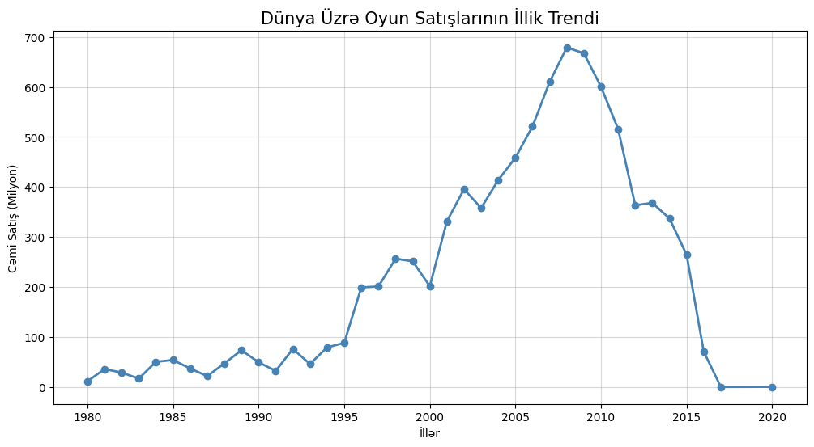
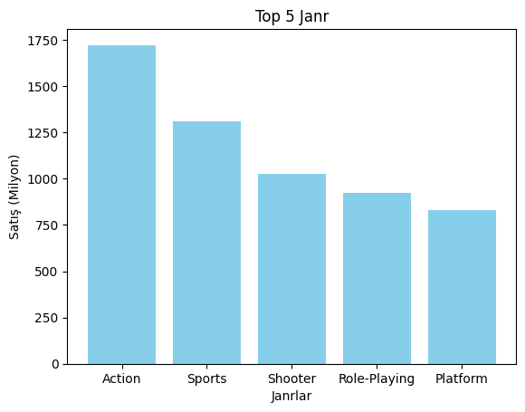
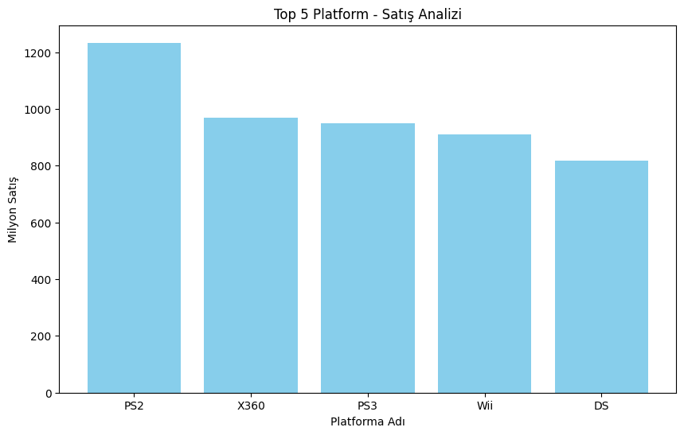
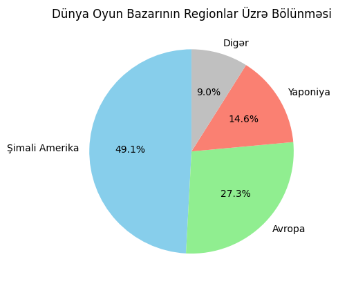
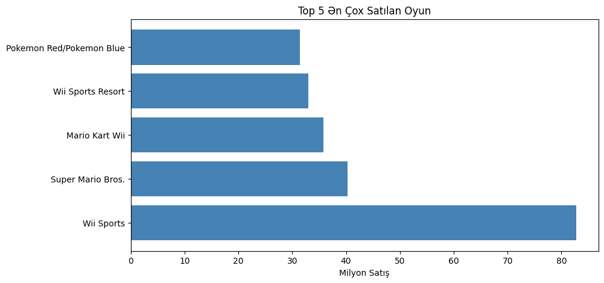

# 🎮 Video Oyun Satışları Analizi (1980-2016)

## 👤 Əlaqə və Müəllif
* **Müəllif:** Hüseyn Əliyev
* **LinkedIn:** www.linkedin.com/in/huseynaliyev25

---

## 📖 Giriş və Proyekt Haqqında
Bu layihə video oyun sənayesinin 36 illik (1980-2016) inkişafını analiz edir. Analiz prosesində əsas məlumat mənbəyi kimi layihə qovluğunda yer alan **`vgsales.csv`** datasetindən istifadə olunmuşdur. 

**Dataset haqqında məlumat (`vgsales.csv`):**
* **Mənbə:** Kaggle (Video Game Sales)
* **Həcm:** 16,500+ oyun statistikası
* **Əhatə dairəsi:** 1980 - 2016-cı illər (və bəzi 2020 proqnozları)
* **Sütunlar:** Oyun adı, Platforma, Buraxılış ili, Janr, Publisher və Regionlar üzrə (NA, EU, JP, Other) satış rəqəmləri.

Bu analiz real verilənlər bazası üzərində platforma, janr və region trendlərini araşdırmaq üçün hazırlanmışdır və mənim data analitikası öyrənmə səyahətimin bir hissəsidir.

### 🎯 Məqsəd:
* Ən uğurlu platformaları və janrları müəyyənləşdirmək.
* Region bazarları (NA, EU, JP) arasındakı fərqləri tapmaq.
* Sənayenin "qızıl dövrlərini" və satış piklərini aşkar etmək.

---

## 🎯 Əsas Tapıntılar (Key Insights)
* **Ən uğurlu platform:** PlayStation 2 (1,255M ümumi satış)
* **Ən populyar janr:** Action (1,751M ümumi satış)
* **Ən böyük bazar:** North America (Qlobal bazarın 49%-i)
* **Pik dövr:** 2008-2009 (İllik ~678M satış)
* **Ən çox satılan oyun:** Wii Sports (82.74M)

### 🔍 Analitik İnsightlar:
1. **Dinamika:** Hər konsol nəsli təxminən 5-7 il bazarda dominant qalır.
2. **Qızıl Era:** 2000-2010 illəri video oyunların fiziki satışda "qızıl erası" hesab olunur.
3. **Regional Fərq:** Yaponiya (JP) bazarı RPG janrını Qərb bazarlarından 3 dəfə daha çox sevir.
4. **Trend Dəyişimi:** 2010-cu ildən sonra mobil oyunların yüksəlişi ilə fiziki disk satışlarında azalma müşahidə olunur.

---

## 📊 Vizuallaşdırmalar

### 1. Dünya Üzrə Oyun Satışlarının İllik Trendi

### 2. Top 5 Janr (Barchart)

### 3. Top 5 Platforma (Barchart)

### 4. Regionların Bazar Payı (Pie Chart)

### 5. Ən Çox Satılan Top 5 Oyun

---

## 🛠️ Texnologiyalar və Metodlar
* **Python**
* **Pandas** - Data cleaning, preprocessing, Groupby, Sort, Filter metodları.
* **Matplotlib** - 25+ interaktiv və statik vizuallaşdırma.
* **Jupyter Notebook** - Addım-addım interaktiv analiz.

---

## 💡 Öyrəndiklərim

Layihə müddətində əldə etdiyim texniki bacarıqlar və təcrübələr:

* ✅ **Böyük Datasetlərlə İş:** 16,000-dən çox sətiri olan real verilənlər bazası ilə işləmək və onları optimallaşdırmaq.
* ✅ **Data Cleaning:** Eksik məlumatların (Missing values) aşkarlanması, silinməsi və ya doldurulması üsullarının tətbiqi.
* ✅ **Effektiv Vizuallaşdırma:** Mürəkkəb statistik göstəriciləri `Matplotlib` vasitəsilə sadə və anlaşılan qrafiklərə çevirmək.
* ✅ **Biznes Analitikası:** Quru rəqəmlərdən real bazar trendləri və biznes üçün faydalı "insight"-lar çıxarmaq bacarığı.
* ✅ **Data Preprocessing:** Analiz üçün məlumatların tipinin düzəldilməsi və qruplaşdırılması (Groupby & Aggregation).

---
*Layihə Data Analitikası öyrənmə prosesinin bir hissəsi kimi hazırlanmışdır.*
